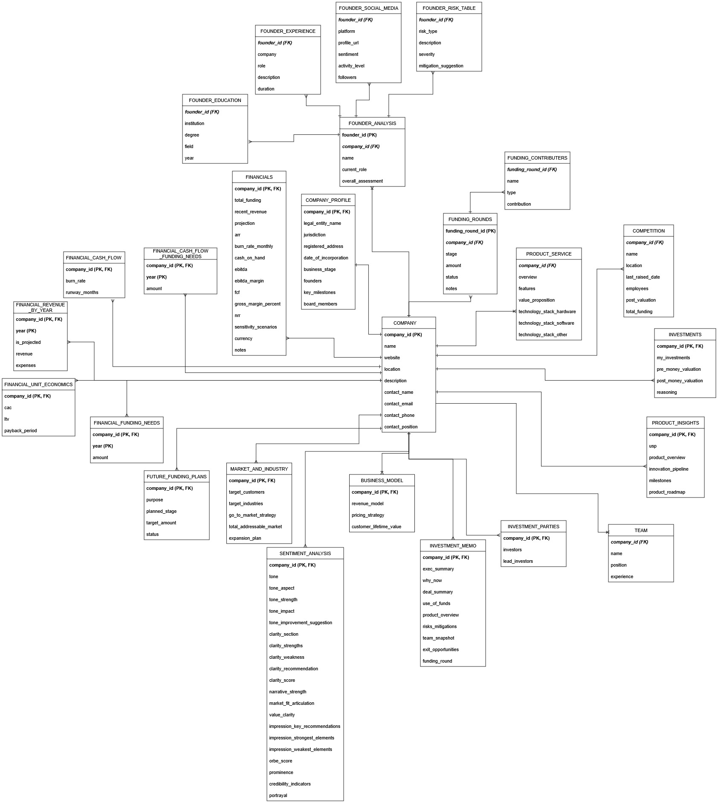

# Orbe Insights ETL Pipeline

This repository contains a Python-based ETL pipeline that extracts nested `JSONB` data from a PostgreSQL source database (`orbe_dev`), transforms it into a normalized structure, and loads it into a target PostgreSQL database (`orbe_insights`) according to a well-defined relational schema.

---

## 📌 Overview

The project is designed to:
- Parse complex `JSONB` columns like `profile`, `financial`, `market`, `product`, etc.
- Map fields to corresponding normalized tables like `COMPANY`, `TEAM`, `FINANCIALS`, `FUNDING_ROUNDS`, and more
- Maintain referential integrity via primary/foreign keys (using UUIDs)
- Efficiently batch-load the target database

---

## 🗃️ Schema Design

The schema has been carefully modeled to normalize nested JSON structures into relational tables. Each major data section (e.g., financials, investment memo, sentiment, product insights) is mapped to dedicated tables.

Refer to the ERD image below for a visual overview of the schema:

---
